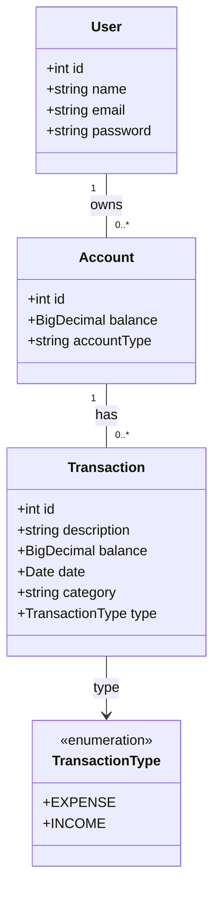

# Projeto API Controle de Gastos

```mermaid
classDiagram
  class User {
    +int id
    +string name
    +string email
    +string password
  }

  class Account {
    +int id
    +BigDecimal balance
    +string accountType
  }

  class Transaction {
    +int id
    +string description
    +BigDecimal balance
    +Date date
    +string category
    +TransactionType type
  }

  class TransactionType {
    <<enumeration>>
    +EXPENSE
    +INCOME
  }

  User "1" -- "0..*" Account : owns
  Account "1" -- "0..*" Transaction : has
  Transaction --> TransactionType : type

```
